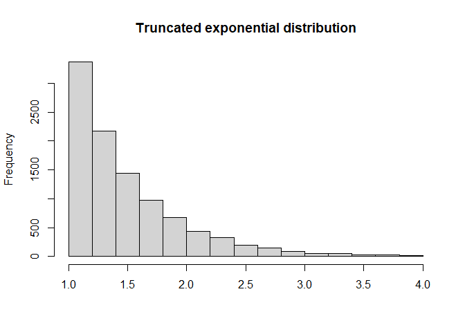

<!-- README.md is generated from README.Rmd. Please edit that file -->

# PDSIR

<!-- badges: start -->

<!-- badges: end -->

The goal of PDSIR is to …

## Installation

You can install the released version of PDSIR from
[CRAN](https://CRAN.R-project.org) with:

``` r
install.packages("PDSIR")
```

And the development version from [GitHub](https://github.com/) with:

``` r
# install.packages("devtools")
devtools::install_github("rmorsomme/PDSIR")
```

## Example

This is a basic example which shows you how to solve a common problem:

``` r
#devtools::install_github("rmorsomme/PDSIR")
library(PDSIR)
## basic example code
```

What is special about using `README.Rmd` instead of just `README.md`?
You can include R chunks like so:

``` r
x <- rexp_trunc(1e4, lambda = 2, lower = 1, upper = 4)
mean(x)
#> [1] 1.496559
```

You’ll still need to render `README.Rmd` regularly, to keep `README.md`
up-to-date. `devtools::build_readme()` is handy for this. You could also
use GitHub Actions to re-render `README.Rmd` every time you push. An
example workflow can be found here:
<https://github.com/r-lib/actions/tree/master/examples>.

You can also embed plots, for example:



In that case, don’t forget to commit and push the resulting figure
files, so they display on GitHub and CRAN.
